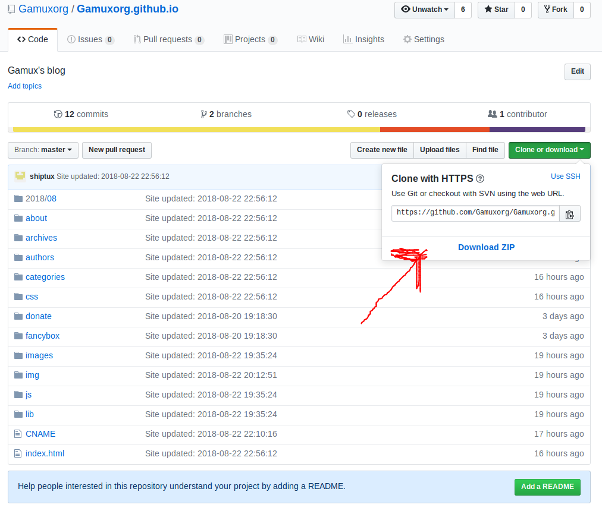

朋友你好，欢迎访问 Linux 游戏站博客网站。这里有一些喜欢 Linux 游戏的人，大家一起交流经验。暂时只有 Gamuxorg 的成员拥有投稿权限。

本博客使用 `Hexo` 进行渲染，并托管于 `Gitpages` ，投稿前需要本地安装 `Git`  以及 `Nodejs`.
##准备工作

<!-- more -->

0. 暂时只有 Gamuxorg 的成员拥有投稿权限。

1. 如果你的电脑上还没有安装 `Git` 以及 `nodejs` ，请先执行 `sudo apt install -y nodejs git` (笔者环境 Ubuntu 18.04)

- cURL:

`$ curl https://raw.github.com/creationix/nvm/master/install.sh | sh`

- Wget:

`$ wget -qO- https://raw.github.com/creationix/nvm/master/install.sh | sh`

2. 访问项目地址 <https://github.com/Gamuxorg/Gamuxorg.github.io> 并 `clone` 仓库

      点击绿色按钮或者复制链接并在本地执行 
     
     `git clone -b hexo https://github.com/Gamuxorg/Gamuxorg.github.io.git`

    这是因为 `Hexo` 渲染后文件在主分支，而源文件在 "Hexo" 分支 所以在获取文件时 需要注意

3. 进入克隆到本地的目录 安装 `Hexo` 可以直接使用 `npm install` 命令 或者分步安装

## 撰写你的文章

完成准备工作之后，你便可以专注于创作了。不管是心得体会，游戏推荐，或者翻译优秀的文章都可以，记得遵循原文作者的版权
。

- 创建文章的方式

    使用 `hexo new "文章"` 建立文章

    直接在 `source/_post` 目录下建立 `Markdown` 类型文件

- 撰写文章
    
    用你喜爱的编辑器编辑 `Markdown` 文件
    
    记得开头添加类似以下内容

 ---
 layout: post
 title: "欢迎加入 Stendhal 中文化工作"
 date: 2018-8-22 20:10:01 +0800
 categories: 征集 
 author: shiptux
 ---

- 文章配图有两种添加方式 

    添加到 `source/img/年/月/日`目录下 使用 `img/年/月/日/图片索引

    如果是 使用 `hexo new "文章"` 建立的文章 则会在 `source/_post/` 产生于文章同名的文件夹 使用 `文章名/图片名` 格式索引 

- 在文章中添加阅读全文模式

    这是摘要

    #<!-- more -->

    这是全文

- 其他需要了解的

    [MarkDown 排版的基本方法](http://wowubuntu.com/markdown/basic.html)。
    
    [中文文案排版指北](https://github.com/mzlogin/chinese-copywriting-guidelines)。
    
    [Hexo官方文档](https://hexo.io/zh-cn/docs/) 

##完成投稿并上传源文件

- 当你撰写完文章时 使用 `hexo generate --deploy` 或者 `hexo deploy --generated` 可以简写 `hexo g -d` 相关的配置已经于 `_config.yml`

- 上传关于本地的内容变化到 `Hexo` 分支上

 `git pull origin hexo:hexo`
 
 `git add .`

 `git commit -m "update"`

 `git push origin hexo`
